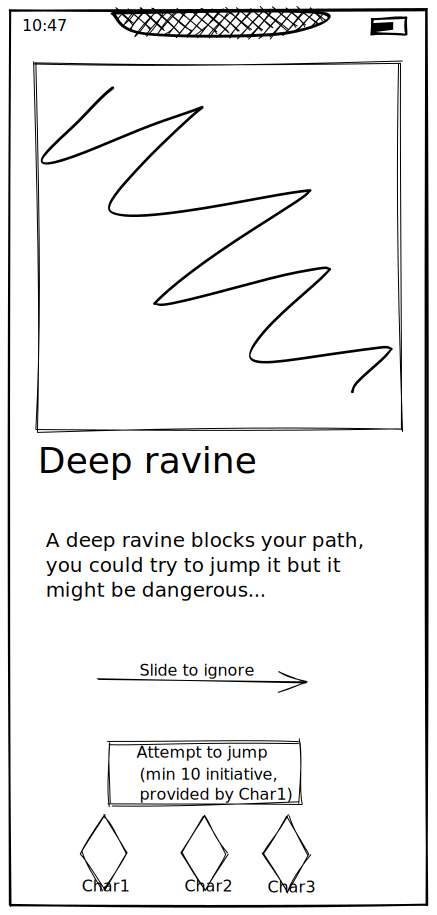

# Dungeons
A core gameplay system is exploring dungeons with a party to gather resources.

## Dungeon card mockup

- note: In contrast to this mockup the formation at the bottom should be a triangle like during [Combat](Combat.md).

## Setup
A dungeon consists of:
- a set of scenario cards
- a boss scenario card

Before entering a dungeon, players choose:
- 3 characters
- a set of scenario cards, limited by the dungeon and destroyed when used

The "dungeon deck" is build by:
- shuffling the dungeon scenario cards and the player scenario cards
- inserting the boss scenario card into the bottom 30% of the deck

## Core interactions
- player chooses a character to "go first" (be on top of the triangle)
- build dungeon deck for each character by choosing new cards from scenarios
  - this way each dungeon run is unique, similar to building a deck in HS/Slay the spire
- deal with combat and negative effects
- use boni and loot
- defeat the boss and win

## Play
A dungeon is played by:

- (optionally before each reveal: The player rotating their character triangle so a different character is "on top")
- a revealed card typically affects the character "on top" (they are going first)
- revealing each card from the top of the deck
- the player handling the scenario and moving on by swiping the card
- revealing the next card from the deck

When a boss scenario card is revealed and handled, swiping to the next card ends the dungeon.

## Scenario Cards

Scenario cards come in different types, typically either as choice or random:
- Negative [Combat scenarios](Combat.md) (Spawn X-Y enemies of type Z)
- Positive Loot scenarios (Earn X items of type Y)
- Positive and negative effect scenarios:
  - Positive Effect scenarios (Swipe to deal X% more damage for the next Y Cards, Swipe to heal the party for X%)
  - Negative Effect scenarios (Deals X% damage to party, lowers party damage by Y%)
    - Can potentially be avoided by having a party member with a tag? "Take 3 damage if you don't have an elf in your party")
    - Can have multiple effects (Deal 3 damage if you don't have a character with initiative > 3, Deal 3 additional damage if no initiative > 2...)
- Dungeon deck change scenarios:
  - Deck interaction scenarios (Look at the next card, choose to put it at bottom. Shuffle deck. Shuffle X cards of type Y into the deck.)
  - Deck change scenarios (Take X resources but shuffle three Y combat scenarios into the dungeon. Do X damage and shuffle a lava pit into the dungeon. Destroy the following two non-boss scenario cards.)
- Character deck change scenarios:
  - Choose between cards to add to the characters deck
    - either temporarely (often, cards disappear after dungeon) or permanently (rare, cards stay after dungeon)
  - Destroy cards in characters deck